# Практика 4. Прикладной уровень

## Программирование сокетов: Прокси-сервер
Разработайте прокси-сервер для проксирования веб-страниц. 
Приложите скрины, демонстрирующие работу прокси-сервера. 

### Запуск прокси-сервера
Запустите свой прокси-сервер из командной строки, а затем запросите веб-страницу с помощью
вашего браузера. Направьте запросы на прокси-сервер, используя свой IP-адрес и номер порта.
Например, http://localhost:8888/www.google.com

_(*) Вы должны заменить стоящий здесь 8888 на номер порта в серверном коде, 
то есть тот, на котором прокси-сервер слушает запросы._

Вы можете также настроить непосредственно веб-браузер на использование вашего прокси сервера. 
В настройках браузера вам нужно будет указать адрес прокси-сервера и номер порта,
который вы использовали при запуске прокси-сервера (опционально).

### А. Прокси-сервер без кеширования (4 балла)
1. Разработайте свой прокси-сервер для проксирования http GET запросов от клиента веб-серверу 
   с журналированием проксируемых HTTP-запросов. В файле журнала сохраняется
   краткая информация о проксируемых запросах (URL и код ответа). Кеширование в этом
   задании не требуется. **(2 балла)**
2. Добавьте в ваш прокси-сервер обработку ошибок. Отсутствие обработчика ошибок может
   вызвать проблемы. Особенно, когда клиент запрашивает объект, который не доступен, так
   как ответ 404 Not Found, как правило, не имеет тела, а прокси-сервер предполагает, что
   тело есть и пытается прочитать его. **(1 балл)**
3. Простой прокси-сервер поддерживает только метод GET протокола HTTP. Добавьте
   поддержку метода POST. В запросах теперь будет использоваться также тело запроса
   (body). Для вызова POST запросов вы можете использовать Postman. **(1 балл)**

Приложите скрины или логи работы сервера.

#### Демонстрация работы
Все действия выполнялись в порядке следования скриншотов.

  Получение страницы <code>lichess.org</code> через Postman 
  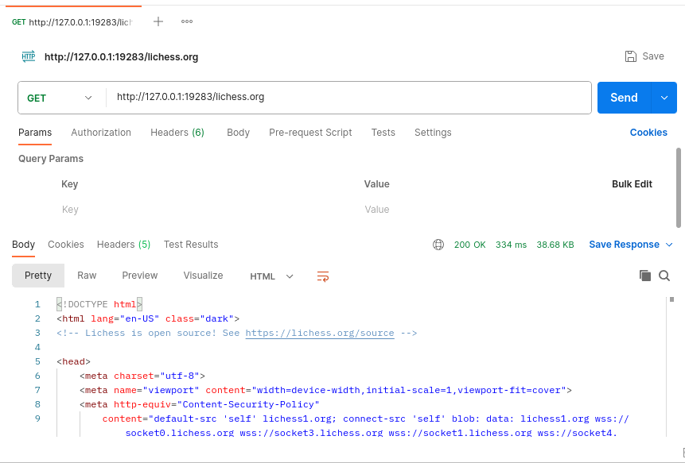 
  Получение страницы <code>lichess.org</code> через браузер 
  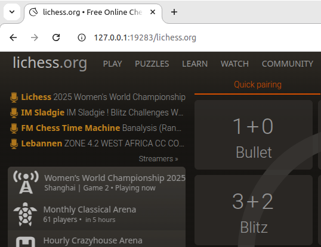 
  Получение несуществующей страницы 
  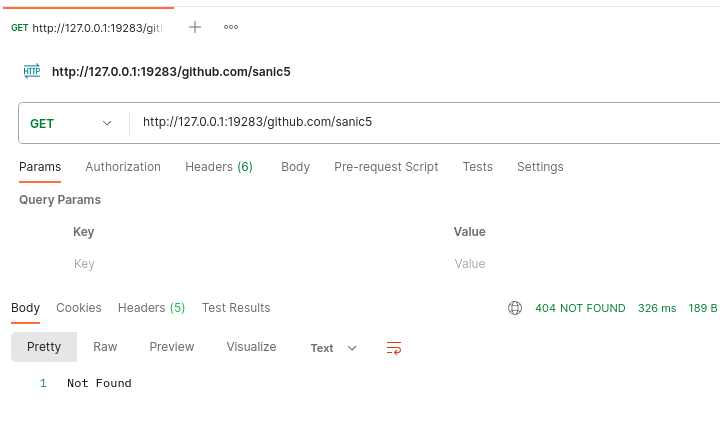 
  Получение страницы с несуществующего сайта (на сервере исключение обрабатывается) 
  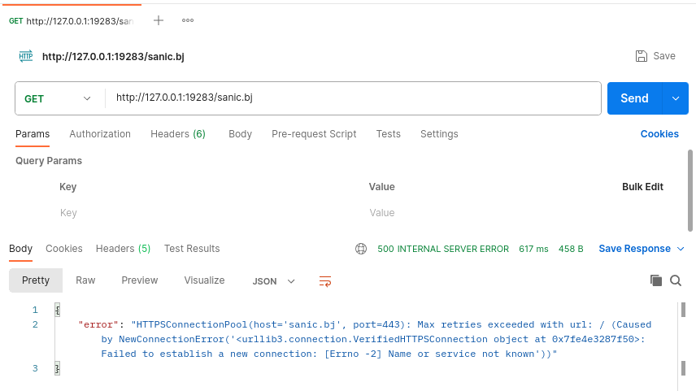 
  Логи сервера после всех операций 
  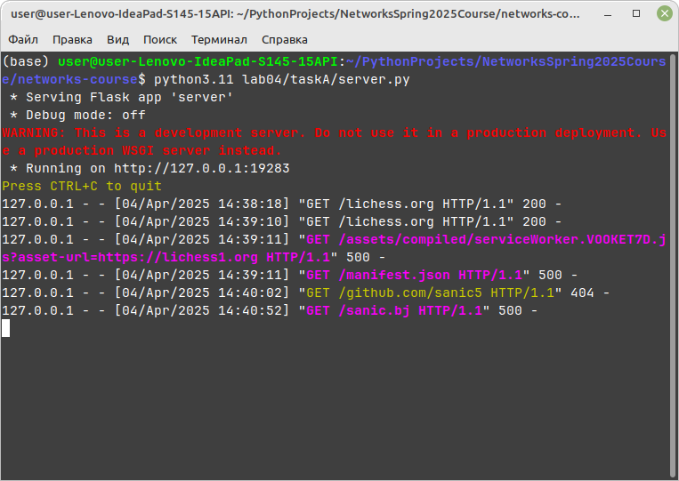 
  Содержимое журнала после всех операций 
  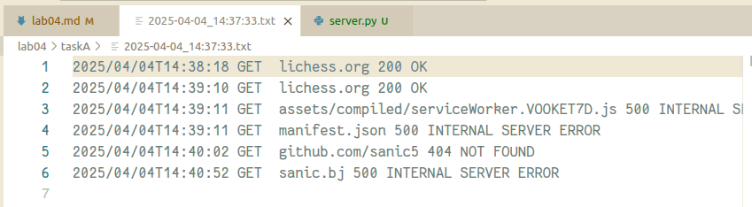 
  Далее я запустил сервер из задания 2. Параметр <code>protocol</code> позволяет указать протокол доступа к странице (по умолчанию <code>https</code>). 
  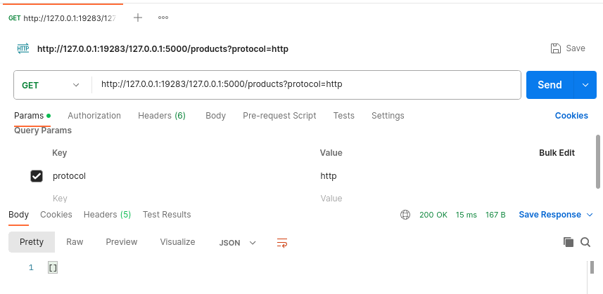 
  Демонстрация работы запроса POST 
  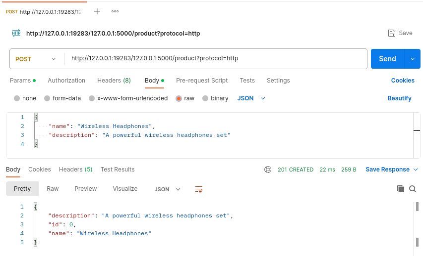 

### Б. Прокси-сервер с кешированием (4 балла)
Когда прокси-сервер получает запрос, он проверяет, есть ли запрашиваемый объект в кэше, и,
если да, то возвращает объект из кэша без соединения с веб-сервером. Если объекта в кэше нет,
прокси-сервер извлекает его с веб-сервера обычным GET запросом, возвращает клиенту и
кэширует копию для будущих запросов.

Для проверки того, прокис объект в кеше или нет, необходимо использовать условный GET
запрос. В таком случае вам необходимо указывать в заголовке запроса значение для If-Modified-Since и If-None-Match. 
Подробности можно найти [тут](https://ruturajv.wordpress.com/2005/12/27/conditional-get-request).

Будем считать, что кеш-память прокси-сервера хранится на его жестком диске. Ваш прокси-сервер
должен уметь записывать ответы в кеш и извлекать данные из кеша (т.е. с диска) в случае
попадания в кэш при запросе. Для этого необходимо реализовать некоторую внутреннюю
структуру данных, чтобы отслеживать, какие объекты закешированы.

Приложите скрины или логи, из которых понятно, что ответ на повторный запрос был взят из кэша.

#### Демонстрация работы

  Получение страницы <code>lichess.org</code> в первый раз 
  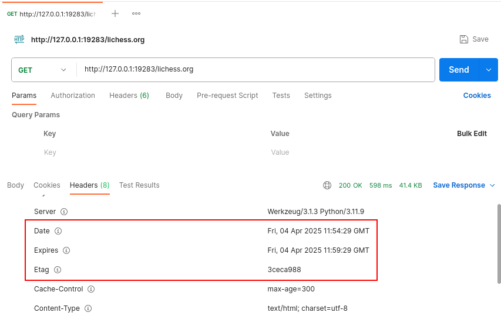 
  Условный GET-запрос. Возвращает 304, так как запись в кэше не изменилась. Запрос не имеет тела 
  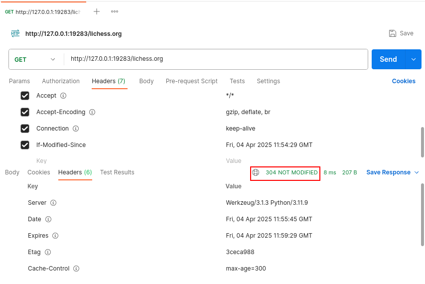 
  Условный GET-запрос. Возвращает 304, так как etag совпадает. (На самом деле потому, что я время поставил неправильно, но если поставить его правильно, то 304 всё равно вернётся из-за etag) 
  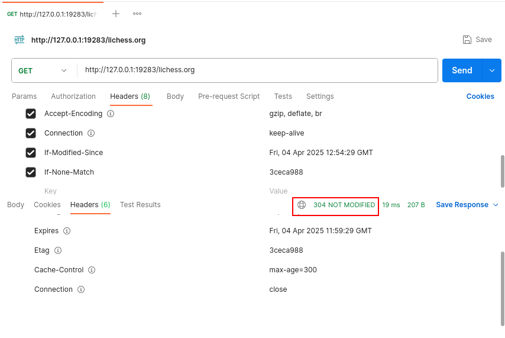 
  Безусловный GET-запрос. Возвращает 200. Запрос имеет тело, но оно было загружено из кэша, о чём свидетельствует совпадающий etag и лог в журнале (см. ниже) 
  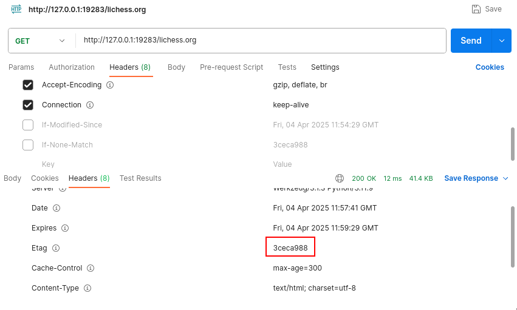 
  Копия в кэше устарела, поэтому была загружена новая с сервера. Срок хранения копии задаётся вторым аргументом командной строки в секундах (по умолчанию 5 минут) 
  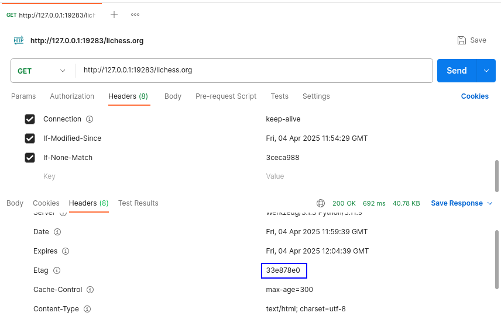 
  Логи сервера после всех операций 
  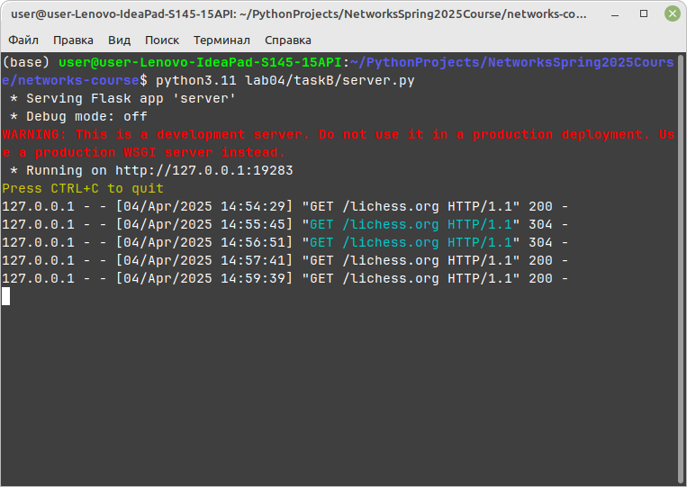 
  Содержимое журнала после всех операций. Журнал сервера из задания 2 устроен сложнее, чем в задании 1 
  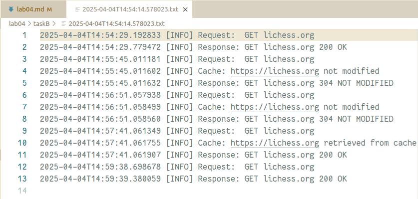 
  Кэш, как он хранится на диске 
  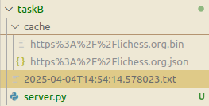 

### В. Черный список (2 балла)
Прокси-сервер отслеживает страницы и не пускает на те, которые попадают в черный список. Вместо
этого прокси-сервер отправляет предупреждение, что страница заблокирована. Список доменов
и/или URL-адресов для блокировки по черному списку задается в **конфигурационном файле**.

Приложите скрины или логи запроса из черного списка.

#### Демонстрация работы

  Получение страницы <code>lichess.org</code> (заблокированы сайты <code>habr.com</code> и <code>livejournal.com</code>) 
  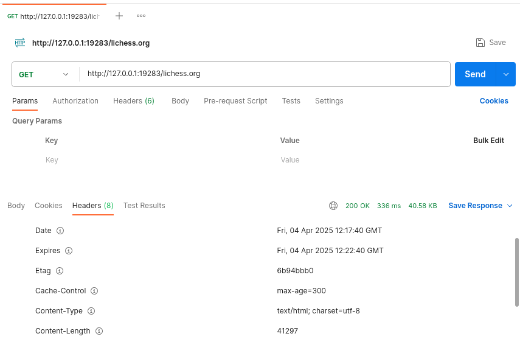 
  Попытка получения страницы <code>habr.com</code> 
  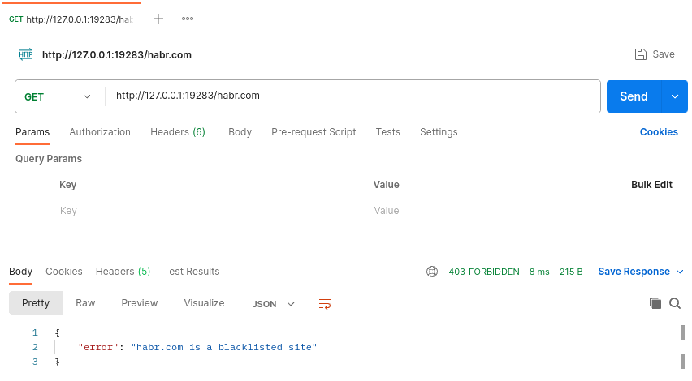 
  Есть защита от получения запрещённой страницы с префиксом www 
   
  Запрещённые ссылки фильтруются по префиксу до соединения с сервером 
  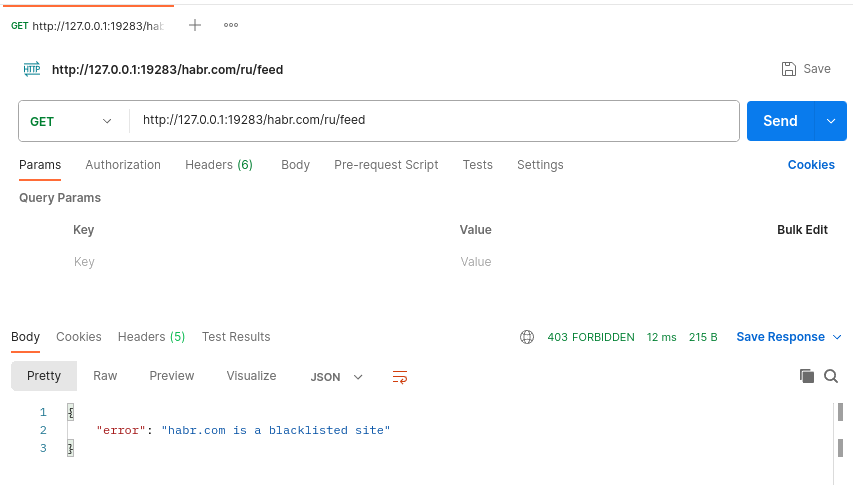 
  Получение страницы <code>lichess.org</code> ещё раз. Сервер возвращает 304 
  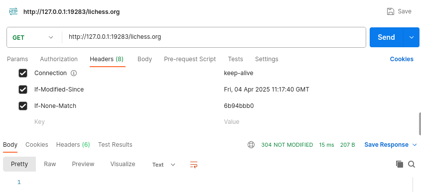 
  Логи сервера 
  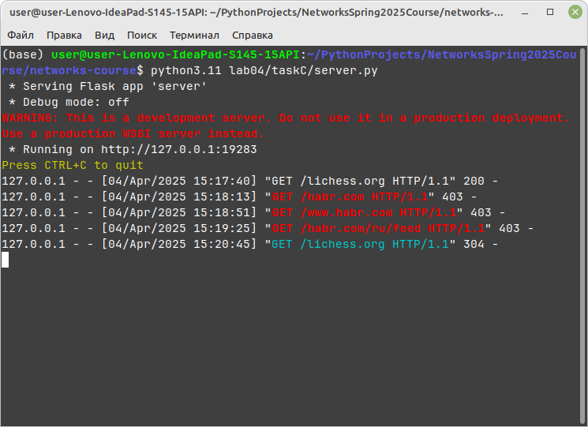 
  Содержимое журнала 
  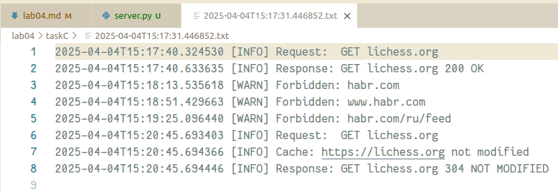 
  Так выглядит файл <code>blacklist.config</code> 
  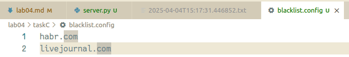 
  К сожалению, использование альтернативного названия запрещённого сайта позволяет обойти блокировку 
  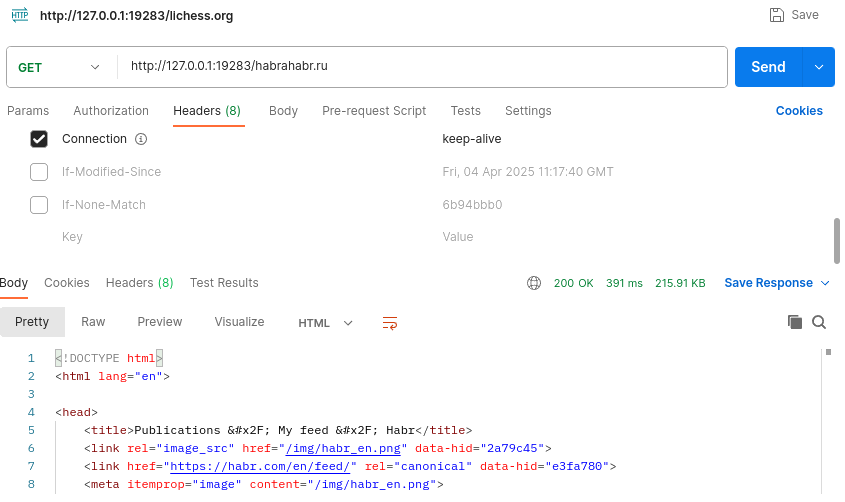 

## Wireshark. Работа с DNS
Для каждого задания в этой секции приложите скрин с подтверждением ваших ответов.

### А. Утилита nslookup (1 балл)

#### Вопросы
1. Выполните nslookup, чтобы получить IP-адрес какого-либо веб-сервера в Азии
   
2. Выполните nslookup, чтобы определить авторитетные DNS-серверы для какого-либо университета в Европе
   
3. Используя nslookup, найдите веб-сервер, имеющий несколько IP-адресов. Сколько IP-адресов имеет веб-сервер вашего учебного заведения?

### Б. DNS-трассировка www.ietf.org (3 балла)

#### Подготовка
1. Используйте ipconfig для очистки кэша DNS на вашем компьютере.
2. Откройте браузер и очистите его кэш (для Chrome можете использовать сочетание клавиш
   CTRL+Shift+Del).
3. Запустите Wireshark и введите <code>ip.addr == ваш_IP_адрес</code> в строке фильтра, где значение
   ваш_IP_адрес вы можете получить, используя утилиту ipconfig. Данный фильтр позволит
   нам отбросить все пакеты, не относящиеся к вашему хосту. Запустите процесс захвата пакетов в Wireshark.
4. Зайдите на страницу www.ietf.org в браузере.
5. Остановите захват пакетов.

#### Вопросы
1. Найдите DNS-запрос и ответ на него. С использованием какого транспортного протокола
   они отправлены?
   - <!-- todo -->
2. Какой порт назначения у запроса DNS?
   - <!-- todo -->
3. На какой IP-адрес отправлен DNS-запрос? Используйте ipconfig для определения IP-адреса
   вашего локального DNS-сервера. Одинаковы ли эти два адреса?
   - <!-- todo -->
   - <!-- todo -->
4. Проанализируйте сообщение-запрос DNS. Запись какого типа запрашивается? Содержатся
   ли в запросе какие-нибудь «ответы»?
   - <!-- todo -->
   - <!-- todo -->
5. Проанализируйте ответное сообщение DNS. Сколько в нем «ответов»? Что содержится в
   каждом?
   - <!-- todo -->
   - <!-- todo -->
6. Посмотрите на последующий TCP-пакет с флагом SYN, отправленный вашим компьютером.
   Соответствует ли IP-адрес назначения пакета с SYN одному из адресов, приведенных в
   ответном сообщении DNS?
   - <!-- todo -->
7. Веб-страница содержит изображения. Выполняет ли хост новые запросы DNS перед
   загрузкой этих изображений?
   - <!-- todo -->

### В. DNS-трассировка www.spbu.ru (2 балла)

#### Подготовка
1. Запустите захват пакетов с тем же фильтром <code>ip.addr == ваш_IP_адрес</code>
2. Выполните команду nslookup для сервера www.spbu.ru
3. Остановите захват
4. Вы увидите несколько пар запрос-ответ DNS. Найдите последнюю пару, все вопросы будут относиться к ней
   
#### Вопросы
1. Каков порт назначения в запросе DNS? Какой порт источника в DNS-ответе?
   - <!-- todo -->
   - <!-- todo -->
2. На какой IP-адрес отправлен DNS-запрос? Совпадает ли он с адресом локального DNS-сервера, установленного по умолчанию?
   - <!-- todo -->
   - <!-- todo -->
3. Проанализируйте сообщение-запрос DNS. Запись какого типа запрашивается? Содержатся
   ли в запросе какие-нибудь «ответы»?
   - <!-- todo -->
   - <!-- todo -->
4. Проанализируйте ответное сообщение DNS. Сколько в нем «ответов»? Что содержится в каждом?
   - <!-- todo -->
   - <!-- todo -->

### Г. DNS-трассировка nslookup –type=NS (1 балл)
Повторите все шаги по предварительной подготовке из Задания B, но теперь для команды <code>nslookup –type=NS spbu.ru</code>

#### Вопросы
1. На какой IP-адрес отправлен DNS-запрос? Совпадает ли он с адресом локального DNS-сервера, установленного по умолчанию?
   - <!-- todo -->
   - <!-- todo -->
2. Проанализируйте сообщение-запрос DNS. Запись какого типа запрашивается? Содержатся ли в запросе какие-нибудь «ответы»?
   - <!-- todo -->
   - <!-- todo -->
3. Проанализируйте ответное сообщение DNS. Имена каких DNS-серверов университета в
   нем содержатся? А есть ли их адреса в этом ответе?
   - <!-- todo -->
   - <!-- todo -->

### Д. DNS-трассировка nslookup www.spbu.ru ns2.pu.ru (1 балл)
Снова повторите все шаги по предварительной подготовке из Задания B, но теперь для команды <code>nslookup www.spbu.ru ns2.pu.ru</code>.
Запись <code>nslookup host_name dns_server</code> означает, что запрос на разрешение доменного имени <code>host_name</code> пойдёт к <code>dns_server</code>.
Если параметр <code>dns_server</code> не задан, то запрос идёт к DNS-серверу по умолчанию (например, к локальному).

#### Вопросы
1. На какой IP-адрес отправлен DNS-запрос? Совпадает ли он с адресом локального DNS-сервера, установленного по умолчанию? 
   Если нет, то какому хосту он принадлежит?
   - <!-- todo -->
   - <!-- todo -->
2. Проанализируйте сообщение-запрос DNS. Запись какого типа запрашивается? Содержатся
   ли в запросе какие-нибудь «ответы»?
   - <!-- todo -->
   - <!-- todo -->
3. Проанализируйте ответное сообщение DNS. Сколько в нем «ответов»? Что содержится в
   каждом?
   - <!-- todo -->
   - <!-- todo -->

### Е. Сервисы whois (2 балла)
1. Что такое база данных whois?
   - <!-- todo -->
2. Используя различные сервисы whois в Интернете, получите имена любых двух DNS-серверов. 
   Какие сервисы вы при этом использовали?
   - <!-- todo -->
   - <!-- todo -->
3. Используйте команду nslookup на локальном хосте, чтобы послать запросы трем конкретным
   серверам DNS (по аналогии с Заданием Д): вашему локальному серверу DNS и двум DNS-серверам,
   найденным в предыдущей части.
   - <!-- todo -->
