# Практика 6. Транспортный уровень

## Wireshark: UDP (5 баллов)
Начните захват пакетов в приложении Wireshark и затем сделайте так, чтобы ваш хост отправил и
получил несколько UDP-пакетов (например, с помощью обращений DNS).
Выберите один из UDP-пакетов и разверните поля UDP в окне деталей заголовка пакета.
Ответьте на вопросы ниже, представив соответствующие скрины программы Wireshark.

#### Вопросы
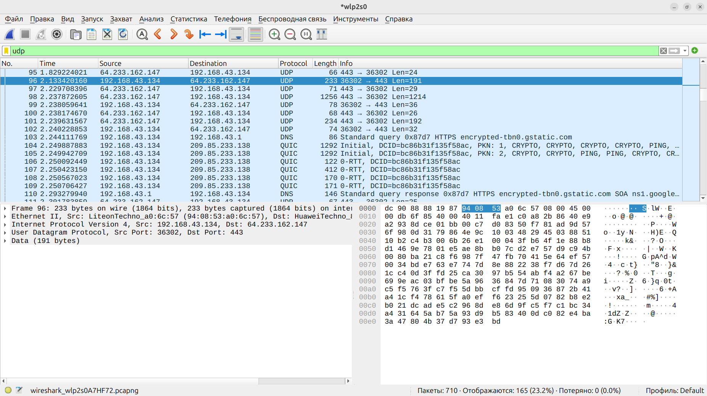 <i>Скриншот захваченного пакета</i>
1. Выберите один UDP-пакет. По этому пакету определите, сколько полей содержит UDP-заголовок.
   - 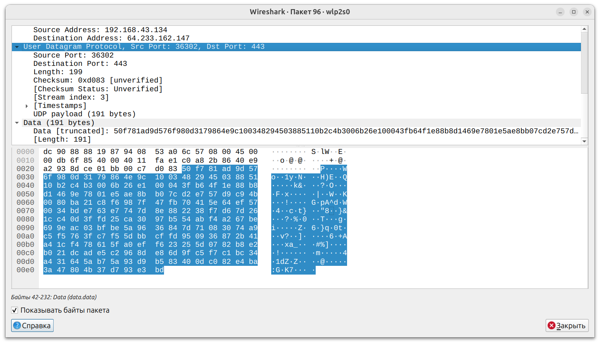 <i>4 поля: порт отправления, порт назначения, длина и контрольная сумма</i>
2. Определите длину (в байтах) для каждого поля UDP-заголовка, обращаясь к отображаемой
   информации о содержимом полей в данном пакете.
   - 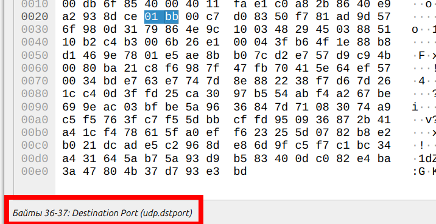 <i>Наводя курсор на разные участки байтового представления датаграммы, внизу можно увидеть информацию о том, какому полю они принадлежат и какова длина этого поля. Все 4 поля имеют длину 2 байта.</i>
3. Значение в поле Length (Длина) – это длина чего?
   - <i>Это длина всей UDP-датаграммы (заголовок + данные). В данном случае 199 = 2 байта порт отпр. + 2 байта порт назн. + 2 байта длина + 2 байта контр. сумма + 191 байт данные.</i>
4. Какое максимальное количество байт может быть включено в полезную нагрузку UDP-пакета?
   - <i>Т. к. макс. значение поля длины 65535 (2 байта), а длина заголовка 8 байт, полезная нагрузка может составлять 65527 байт. (Но на практике при использовании IPv4 предел равен 65507, т. к. требуется ещё 20 байт на IP-заголовок).</i>
5. Чему равно максимально возможное значение номера порта отправителя?
   - <i>Очевидно, 65535, т. к. это максимальное значение соответствующего поля</i>
6. Какой номер протокола для протокола UDP? Дайте ответ и для шестнадцатеричной и
   десятеричной системы. Чтобы ответить на этот вопрос, вам необходимо заглянуть в поле
   Протокол в IP-дейтаграмме, содержащей UDP-сегмент.
   - <i>17 (0x11)</i>
7. Проверьте UDP-пакет и ответный UDP-пакет, отправляемый вашим хостом. Определите
   отношение между номерами портов в двух пакетах.
   - <i>Конкретно эти две пары хост-порт много обменивались UDP-пакетами, а UDP-пакеты не содержат никакой информации о времени или связи между ними, поэтому я предполагаю, что ответный пакет - следующий захваченный Wireshark пакет. Как легко убедиться, порт отправления и порт назначения у него переставлены местами.</i>
    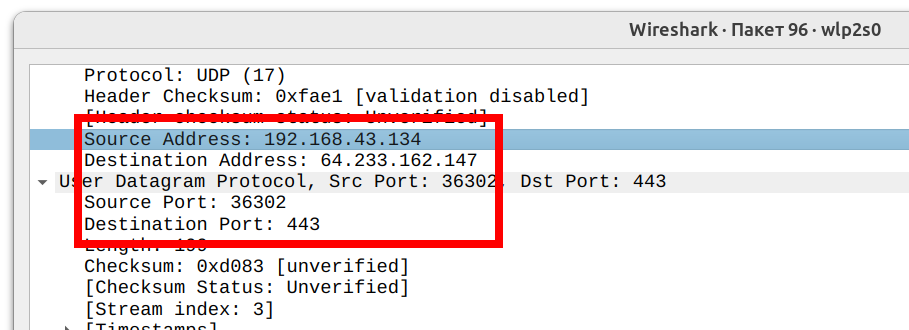
    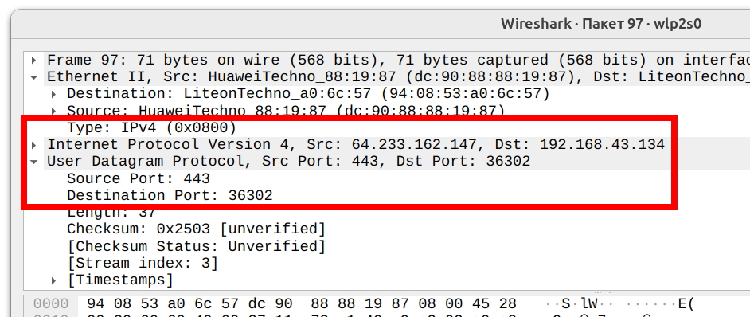

## Программирование. FTP

### FileZilla сервер и клиент (3 балла)
1. Установите сервер и клиент [FileZilla](https://filezilla.ru/get)
2. Создайте FTP сервер. Например, по адресу 127.0.0.1 и портом 21. 
   Укажите директорию по умолчанию для работы с файлами.
3. Создайте пользователя TestUser. Для простоты и удобства можете отключить использование сертификатов.
4. Запустите FileZilla клиента (GUI) и попробуйте поработать с файлами (создать папки,
добавить/удалить файлы).

Приложите скриншоты.

#### Скрины
todo

### FTP клиент (3 балла)
Создайте консольное приложение FTP клиента для работы с файлами по FTP. Приложение может
обращаться к FTP серверу, созданному в предыдущем задании, либо к какому-либо другому серверу 
(есть много публичных ftp-серверов для тестирования, [вот](https://dlptest.com/ftp-test/) один из них).

Приложение должно:
- Получать список всех директорий и файлов сервера и выводить его на консоль
- Загружать новый файл на сервер
- Загружать файл с сервера и сохранять его локально

Бонус: Не используйте готовые библиотеки для работы с FTP (например, ftplib для Python), а реализуйте решение на сокетах **(+3 балла)**.

#### Демонстрация работы
Я реализовал код клиента на сокетах. Код находится в файле `ftp-client.py`.

  Запуск FTP-клиента 
  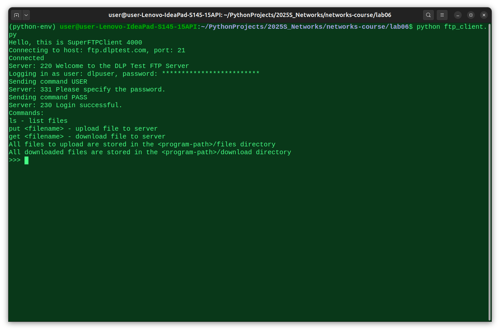 
  Файлы для выгрузки на сервер хранятся в папке `files`. Загруженные с сервера файлы хранятся в папке `download`. 
  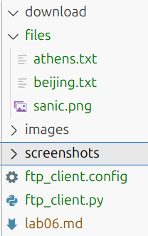 
  Листинг файлов (команда `ls`) 
  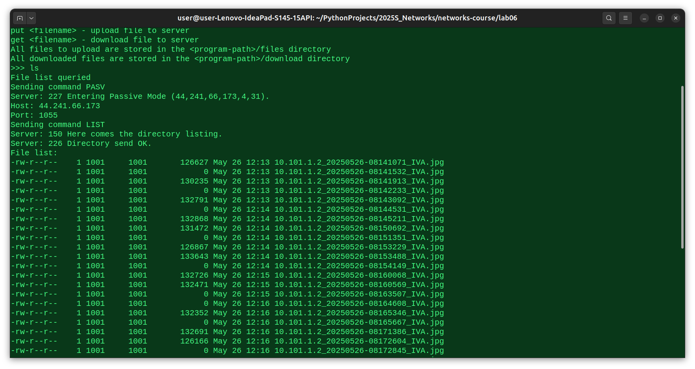 
  Выгрузка файла `athens.txt` на сервер 
  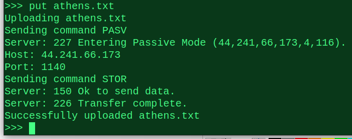 
  Файл `athens.txt` на сервере 
  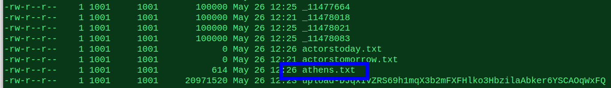 
  Загрузка файла `athens.txt` с сервера 
  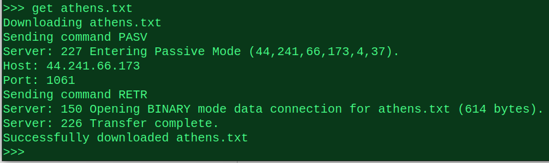 
  Загруженный файл 
  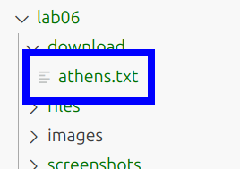 
  Контент загруженного файла корректен 
  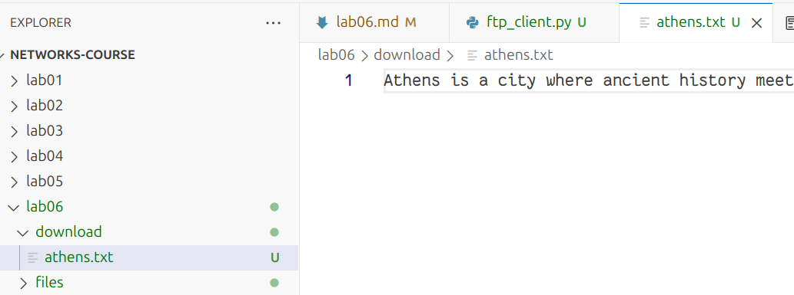 
  Поскольку сервер публичный, можно загрузить чужой файл 
  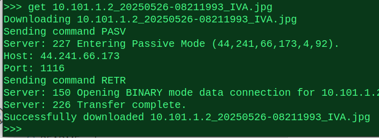 
  Загруженный jpg-файл 
  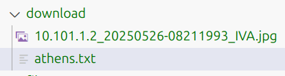 
  Выгрузка двоичного файла 
  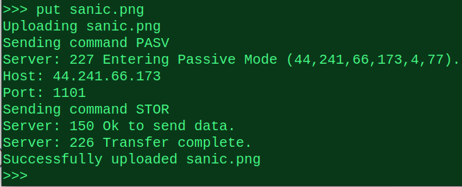 
  Примечание: сервер ftp.dlptest.com отвечает выборочно и не всегда может установить соединение. Для этого предусмотрена возможность прервать выполнение текущей команды с помощью `Ctrl+C`. Также, если никакая команда не выполняется, эта комбинация клавиш адекватно выходит из программы.

### GUI FTP клиент (4 балла)
Реализуйте приложение FTP клиента с графическим интерфейсом. НЕ используйте C#.

Возможный интерфейс:

В приложении должна быть поддержана следующая функциональность:
- Выбор сервера с указанием порта, логин и пароль пользователя и возможность
подключиться к серверу. При подключении на экран выводится список всех доступных
файлов и директорий
- Поддержаны CRUD операции для работы с файлами. Имя файла можно задавать из
интерфейса. При создании нового файла или обновлении старого должно открываться
окно, в котором можно редактировать содержимое файла. При команде Retrieve
содержимое файла можно выводить в главном окне.

#### Демонстрация работы
todo

### FTP сервер (5 баллов)
Реализуйте свой FTP сервер, который работает поверх TCP сокетов. Вы можете использовать FTP клиента, реализованного на прошлом этапе, для тестирования своего сервера.
Сервер должен реализовать возможность авторизации (с указанием логина/пароля) и поддерживать команды:
- CWD
- PWD
- PORT
- NLST
- RETR
- STOR
- QUIT

#### Демонстрация работы
todo
